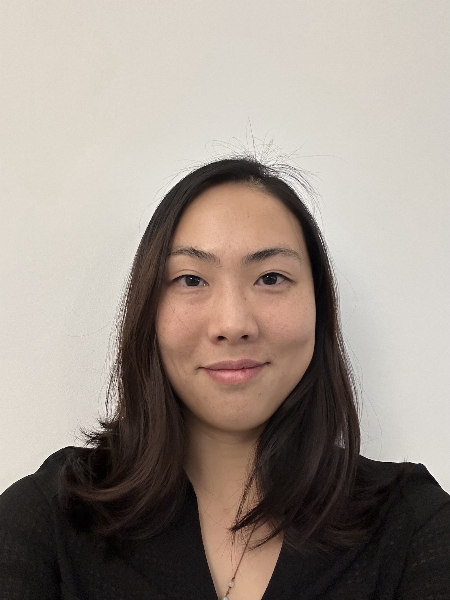
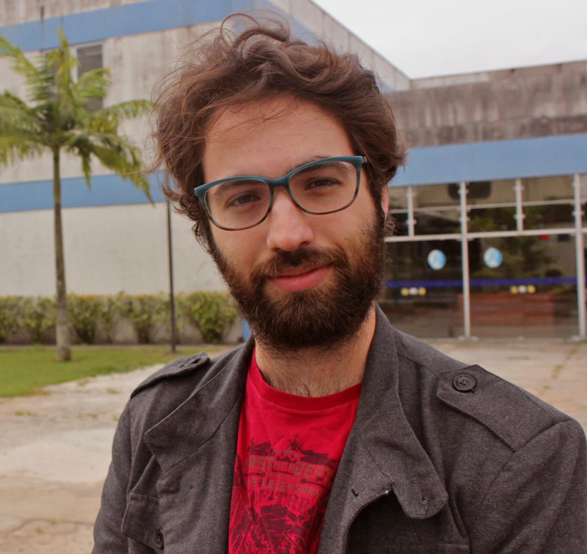

# Meet Your Faculty

<!--#### NAME

>JOB TITLE  
INSTITUTION  
LOCATION
>
> --- CONTACT INFO, IF PROVIDED

BIO GOES HERE-->

#### Richard LeDuc (he/him)

>Director of Bioinformatics  
Children’s Hospital Research Institute of Manitoba  
Winnipeg, MB, Canada  
>
> --- RLeduc@chrim.ca

Rich LeDuc is the Director of Bioinformatics at CHRIM and an Associate Professor in Biochemistry and Medical Genetics at the University of Manitoba. At CHRIM, he oversees the statistical, data analytic, software development, and cyberinfrastructure needs of the institute, including omic workflows in fields such as transcriptomics, proteomics, and metabolomics. He has been developing high-performance computational infrastructure to support patient-centered research in Manitoba as well as maintaining the Data Café, a drop-in bioinformatic support service.

#### Constance Li (she/her)

>Assistant Professor (Teaching)  
University of Calgary, Biochemistry & Molecular Biology  
Calgary, AB, Canada  
>
> --- constance.li@ucalgary.ca

Connie is an assistant professor of teaching at the University of Calgary and member of the Arnie Charbonneau Cancer Institute. Her teaching portfolio spans bioinformatics training from data generation through biological interpretation. Her research centers on integrative multi-omic analysis of the tumour microenvironment.

#### Diogo Pellegrina (he/him)

>Postdoctoral Fellow  
University of Saskatchewan, VIDO  
Saskatoon, SK, Canada
>
> --- diogo.pellegrina@usask.ca

Diogo is a Postdoctoral Fellow at the Vaccines and Infectious Diseases Organisation (VIDO) at USask. Previously I did my PhD in the University of Sao Paulo, and I was also a Postdoc at OICR. I worked with many types of Bioinformatics pipelines, but mostly with Transcriptomics and Network Analysis.
